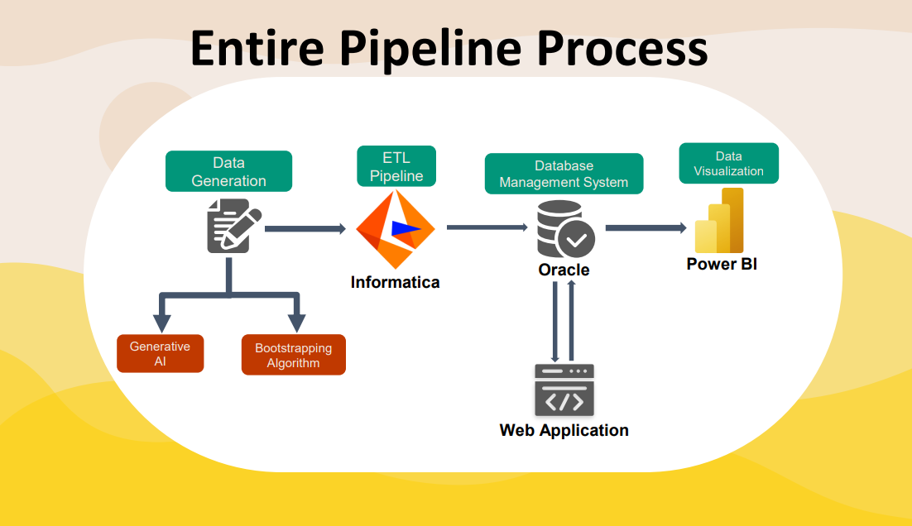
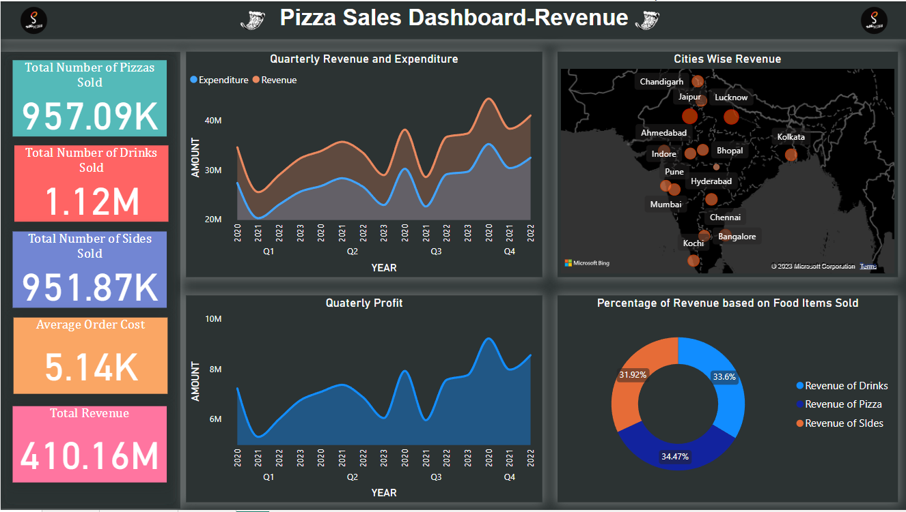
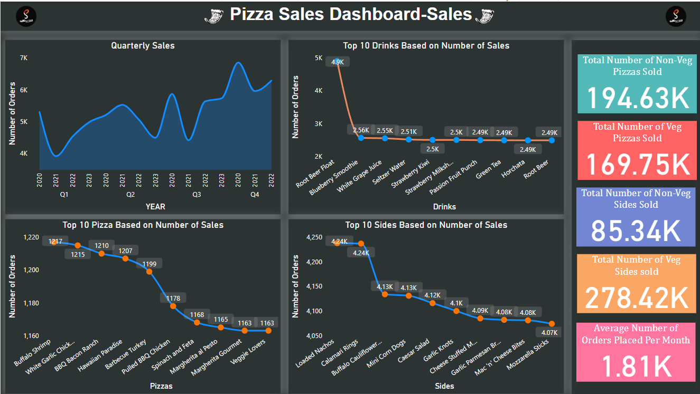
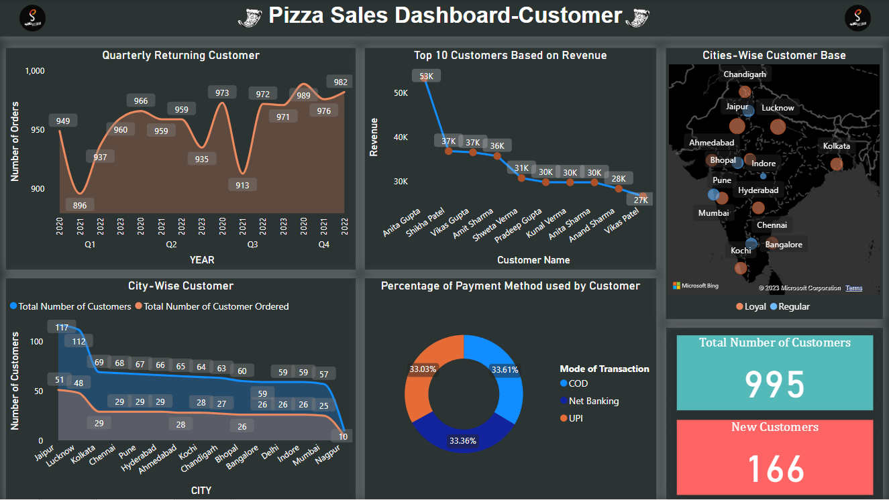
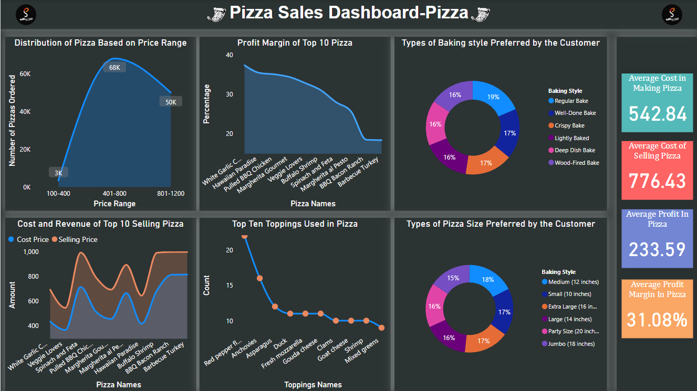

SIG_PIZZARIA DATA ENGINEERING PROJECT
---------------------------------------------
----------------------------------

Created an end-to-end Data engineering project using tools like python, Sql(oracle), Informatica(ETL Tool), to create a data engineering pipeline that in realtime, that will use Pwer BI dashboard to visualize the revenue, sales customer and pizza data in realtime from the data pipeline. The data is generated from stratch and is fully original.

Here is the Image of the Data Engineering Pipeline:

Here are the Dashboards used in the Data Visualization

